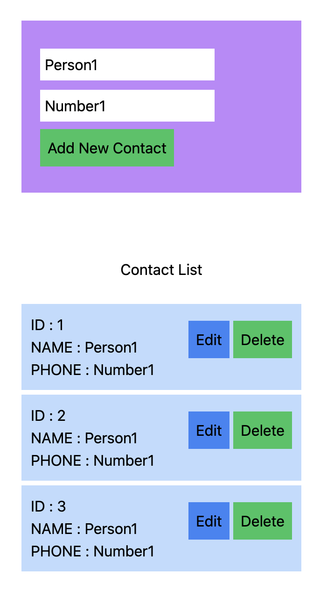

# rjplay
learning onlyjs

##### Create 3 contact with same value

##### Edit Contact 2 and then updated value

##### Edit Contact 3 and then updated value

##### Contact 2 is deleted

##### Again edit Contact 3 and then updated value

